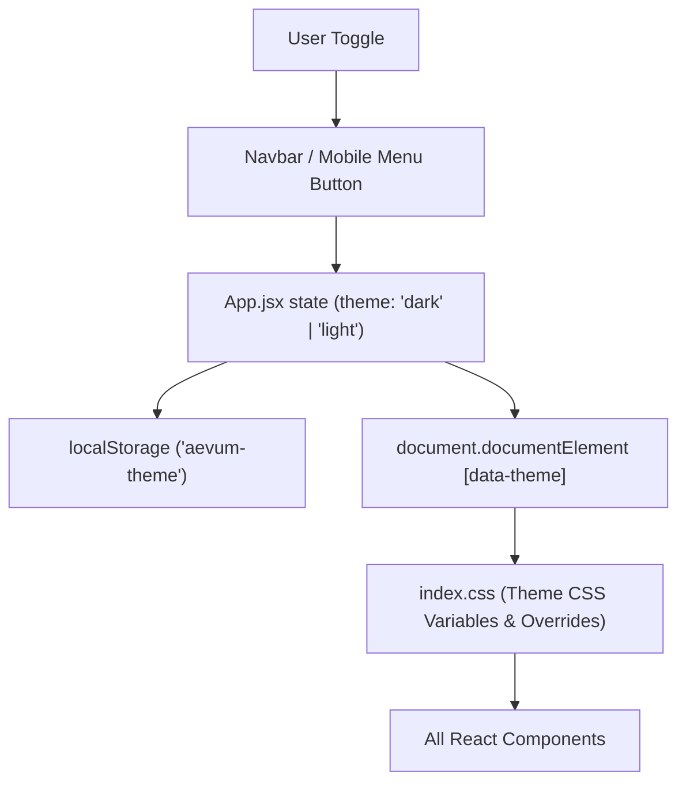

## SQUAD & SWARM
- Architect: Vidus (ARC-VIDUS-AUHD2Y)
- Developer: An (ENG-AN-7B9F1D)
- Strategy: Sequential Consensus

## DESCRIPTION
Tích hợp chế độ Dark Mode (giao diện tối gốc Aevum-Electron hiện tại) và Light Mode (giao diện sáng tương phản cao) cho toàn bộ website Aevum OS. Cho phép người dùng chuyển đổi linh hoạt qua nút bấm trên Navbar và lưu lại cấu hình trong localStorage.

## GOAL
1. Đảm bảo hỗ trợ 2 chế độ Dark & Light Mode 100% tương thích với thiết kế gốc.
2. Hiệu ứng chuyển theme CSS mượt mà (smooth transition 0.3s).
3. Duy trì trạng thái qua localStorage `aevum-theme`.

## ARCHITECTURAL CONTEXT

## BOUNDARY & ENCAPSULATION
- **Public API**: `data-theme` attribute on `<html>`, `localStorage.getItem('aevum-theme')`.
- **Internal Details**: Specific CSS color variables & style overrides defined in `src/index.css`.

## AEVUM CONTRACT
- **Inbound Context**: `aevum-theme` stored in browser storage.
- **Outbound Handshake**: Updated DOM state reflecting active theme.

## IMPLEMENTATION STEPS
- [x] [FEAT] [CREATE_PLAN] Khởi tạo bản kế hoạch tích hợp Dark/Light Mode. [Evidence: Plan registered in index.json] [Est: 5m]
- [ ] [FEAT] [STYLES] Cập nhật `src/index.css` định nghĩa các biến màu cho Dark & Light Mode cùng hiệu ứng transition. [Evidence: CSS variables in index.css] [Est: 15m]
- [ ] [FEAT] [LOGIC] Tích hợp state theme & `data-theme` handler vào `src/App.jsx`. [Evidence: App.jsx state hook] [Est: 10m]
- [ ] [FEAT] [UI] Thêm nút đổi giao diện Sun/Moon vào `src/components/Navbar.jsx` (Desktop + Mobile). [Evidence: Theme switcher button in Navbar] [Est: 15m]
- [ ] [FEAT] [VERIFY] Kiểm tra hoạt động trên cả 2 chế độ sáng và tối. [Evidence: Build & runtime test] [Est: 10m]

## KNOWLEDGE HARVEST
- Chuyển đổi theme qua data-attribute `data-theme` kết hợp CSS Variables giúp tối ưu hóa hiệu năng render so với việc re-render lại toàn bộ component tree.
