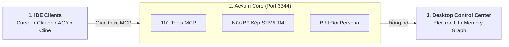

# Tổng quan về Aevum OS

**Aevum OS** là Hệ điều hành Không gian làm việc dành cho Agent (Agentic OS) và **Bộ não Ngoại vi (External Brain)** độc lập dành cho các AI Coding Agent (Cursor, Claude, Antigravity, VS Code).

Hệ thống giải quyết triệt để vấn đề lớn nhất mà lập trình viên gặp phải khi làm việc với AI: **AI nhanh quên ngữ cảnh (Context Amnesia)**, lan man ngoài phạm vi dự án và tiêu tốn quá nhiều token vô ích.

> [!NOTE]
> **Phiên bản mới nhất**: [Aevum OS v1.0.0-beta.6](/changelog) — Chạy trên lõi Fastify v5 Core Daemon (Port 3344), hỗ trợ 101 công cụ Model Context Protocol (MCP) chuẩn hóa. Xem chi tiết tại [Nhật ký Cập nhật](/changelog).

---

## Nỗi Đau Thực Tế & Cách Aevum OS Giải Quyết

| Vấn đề khi dùng AI Coding thông thường | Cách Aevum OS giải quyết triệt để |
|---|---|
| **AI mau quên (Context Amnesia)**: Sau vài lượt chat, AI quên mất cấu trúc dự án, quên lời dặn ban đầu của bạn. | **Bộ nhớ Dài hạn (LTM)**: Lưu trữ vĩnh viễn các quy tắc, sở thích và bài học kiến trúc của bạn vào kho lưu trữ độc lập. |
| **Lãng phí Token**: Nhồi nhét hàng nghìn dòng code vào prompt khiến context window bị đầy và chi phí tăng vọt. | **Nén Ngữ nghĩa (Semantic Compression)**: Tự động trích xuất cấu trúc trọng tâm, tiết kiệm tới 70% token mà vẫn giữ trọn vẹn ngữ cảnh. |
| **Code thiếu kiểm soát**: AI tự ý sửa code lung tung, phá vỡ kiến trúc sẵn có của hệ thống. | **Kiến trúc DDD & Kế hoạch (Plan-First)**: Mọi thay đổi lớn đều phải lập kế hoạch rõ ràng và được bạn phê duyệt trước khi viết code. |
| **Chỉ có 1 AI làm tất cả**: Một mô hình đơn lẻ vừa phải thiết kế kiến trúc, vừa viết code, vừa rà soát bảo mật. | **Biệt đội Persona Không Giới Hạn**: Tuyển dụng linh hoạt theo nhu cầu dự án; bắt đầu ngay với Bộ Tứ Cốt Lõi (An, Luna, Vidus, Zenith). |

---

## Kiến trúc Tổng quan Đơn giản cho Developer

Thay vì để AI phụ thuộc hoàn toàn vào cửa sổ chat của IDE, Aevum OS chạy như một **máy chủ MCP độc lập**:

---

## Các Tính Năng Đột Phá Nổi Bật

1. **Giao thức Chuẩn Model Context Protocol (MCP)**: Tương thích sẵn với Cursor, Claude Desktop, Antigravity IDE và Cline. Chỉ cần copy 3 dòng cấu hình là chạy được ngay.
2. **Nghi thức Bắt tay (Handshake Ritual)**: Mỗi khi mở IDE, AI tự động kết nối, chào hỏi và nạp đúng nhân cách cùng toàn bộ quy tắc dự án.
3. **Quản trị Kế hoạch (Dual-Plan Bridge)**: Bạn viết kế hoạch trong IDE, Aevum tự động đồng bộ sang bảng điều khiển để theo dõi tiến độ từng dòng code.
4. **Tự Động Đúc Kết Kỹ Năng (Skill System)**: Khi AI giải quyết xong một lỗi hóc búa, bạn có thể bảo AI lưu lại thành quy trình chuẩn (SOP) để cả đội cùng tái sử dụng mãi mãi.
