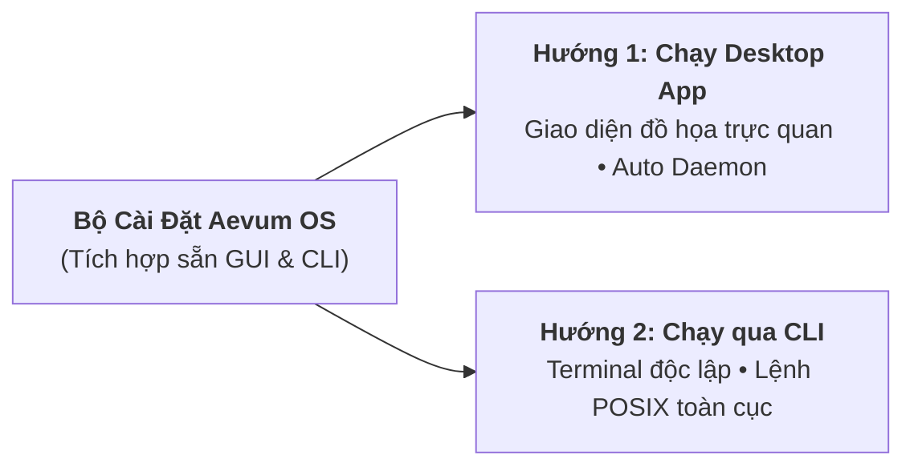

# Cài đặt & Thiết lập Nhanh (3 Phút Quickstart)

Aevum OS cung cấp bộ cài đặt máy tính để bàn (Desktop App) hoàn chỉnh. Khi bạn cài đặt Desktop App, hệ sinh thái Aevum OS sẽ **tự động thiết lập sẵn toàn bộ Core Daemon và tích hợp bộ công cụ dòng lệnh (Aevum CLI) toàn cục vào biến môi trường hệ thống**. 

Bạn không cần phải cài đặt môi trường rời rạc hay thao tác phức tạp!

> [!NOTE]
> **Phiên bản mới nhất**: [Aevum OS v1.0.0-beta.6](/changelog) — Tải trực tiếp tại [Nhật ký Cập nhật](/changelog) hoặc [GitHub Releases](https://github.com/hainguyen011/aevum-os-releases/releases/latest).

---

## Bước 1: Tải & Cài Đặt Gói Ứng Dụng

Chọn gói cài đặt phù hợp với hệ điều hành của bạn:

* **Windows 10 / 11**: Tải [Aevum-OS-Setup-1.0.0-beta.6.exe](/changelog)
* **macOS (Apple Silicon M1-M4)**: Tải [Aevum-OS-1.0.0-beta.6-mac-arm64.dmg](/changelog)
* **macOS (Intel)**: Tải [Aevum-OS-1.0.0-beta.6-mac-x64.dmg](/changelog)

> [!TIP]
> **Lưu ý bảo mật khi cài đặt lần đầu:**
> * Trên **Windows**: Nếu hiện màn hình thông báo SmartScreen, bạn bấm **More info** ➔ **Run anyway**.
> * Trên **macOS**: Nhấn giữ phím **Control** + click chuột phải vào app ➔ Chọn **Open** để vượt qua Gatekeeper.

Quá trình cài đặt hoàn tất sẽ tự động tạo lối tắt trên màn hình và gắn lệnh `aevum` vào Terminal/PowerShell của bạn.

---

## Bước 2: Lựa Chọn 1 Trong 2 Hướng Sử Dụng

Sau khi cài đặt xong, bạn có thể lựa chọn 1 trong 2 hướng sử dụng độc lập dưới đây tùy theo thói quen làm việc:



---

### Hướng 1: Chạy Ứng dụng Desktop (Desktop Control Center GUI)

Dành cho lập trình viên và vibe coder muốn theo dõi hệ thống qua giao diện đồ họa trực quan:

1. **Khởi động**: Mở ứng dụng **Aevum OS** từ màn hình Desktop (Windows) hoặc thư mục Applications / Launchpad (macOS).
2. **Cơ chế tự động**: Ngay khi ứng dụng mở ra, **Fastify v5 Core Daemon** tự động kích hoạt ngầm tại cổng `3344` mà bạn không cần phải giữ bất kỳ cửa sổ dòng lệnh nào.
3. **Các tính năng trên giao diện đồ họa**:
   * **Workspace Overview**: Theo dõi chỉ số sức khỏe codebase và nhật ký hoạt động thời gian thực.
   * **Agent Chat View**: Trò chuyện trực tiếp với Persona cùng bộ chọn mô hình linh hoạt (Gemini 3.7 Flash, Claude 3.5 Sonnet, GPT-4o).
   * **Skill Tree Canvas**: Khám phá cây kỹ năng và lộ trình nghiên cứu trực quan.
   * **Living Memory Graph**: Quan sát đồ thị tri thức sống động neo theo từng file mã nguồn.

---

### Hướng 2: Chạy thông qua Dòng lệnh (CLI Terminal Engine)

Dành cho kỹ sư yêu thích terminal, script tự động hóa hoặc muốn chạy headless:

Vì bộ cài đặt đã cấu hình sẵn lệnh `aevum` toàn cục, bạn chỉ cần mở bất kỳ cửa sổ Terminal, PowerShell hoặc Bash nào và thực thi:

```bash
# 1. Khởi chạy máy chủ MCP Fastify Daemon tại cổng mặc định 3344
aevum

# 2. Kiểm tra trạng thái sức khỏe và các công cụ sẵn sàng
aevum status
# Output: ONLINE (Port 3344, Fastify v5 Core, 101 Tools Sẵn sàng)

# 3. Kiểm tra nhịp tim lắng nghe phản hồi siêu tốc (< 1ms)
aevum ping
# Output: pong (Aevum Fastify Daemon is healthy)

# 4. Khởi động giao diện Desktop từ Terminal bất kỳ lúc nào
aevum gui
```

---

## Bước Kế Tiếp

Sau khi Aevum OS đã chạy (qua Desktop App hoặc lệnh CLI), bước tiếp theo là kết nối Aevum OS vào IDE lập trình của bạn (Cursor, Claude Desktop, Antigravity, VS Code).

Hãy chuyển sang mục tiếp theo: **[Tích hợp (Integration)](/docs/integration)**.
