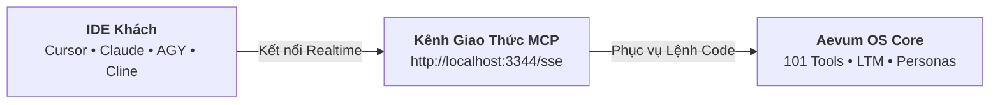

# Tích hợp IDE & Bên Thứ Ba (Integration)

Aevum OS hoạt động như một máy chủ ngoại vi độc lập thông qua giao thức chuẩn **Model Context Protocol (MCP)**. Bạn có thể tích hợp Aevum OS vào bất kỳ môi trường lập trình AI yêu thích nào: Cursor, Claude Desktop, Google Antigravity IDE, Windsurf, Zed hay VS Code.

Hệ thống hỗ trợ 2 phương thức kết nối:
1. **Phương pháp 1 (Khuyến nghị)**: Kích hoạt tự động 1-Click qua tab **Integrations** trên ứng dụng Desktop.
2. **Phương pháp 2 (Thủ công)**: Thêm cấu hình JSON vào tệp `mcp.json` / `mcp_config.json` của IDE.



> [!IMPORTANT]
> **Điều kiện tiên quyết**: Đảm bảo Aevum OS đang hoạt động trên máy tính của bạn (đang mở **Aevum Desktop App** hoặc đang chạy lệnh `aevum` trong Terminal).

---

## Phương pháp 1: Kích Hoạt Tự Động 1-Click qua Desktop UI (Khuyến nghị)

Giao diện bảng điều khiển **Aevum OS Desktop Control Center** (mục **Integrations**) cung cấp cơ chế tự động cấu hình (Auto-Configuration) thông minh nhất. Bạn không cần phải tìm đường dẫn tệp ẩn hay chỉnh sửa cú pháp JSON thủ công.


### 1. Khu vực Tích hợp Trình Soạn Thảo (Local Client Integration)

Nằm ở cột bên trái của tab **Integrations**, hệ thống tự động quét và nhận diện các IDE lập trình AI đã cài đặt trên máy của bạn:

| Trình soạn thảo | Tệp cấu hình mục tiêu | Hành động 1-Click |
|---|---|---|
| **Cursor IDE** | `.cursor/mcp.json` | Gạt switch sang **ON** để tự động liên kết |
| **Claude Desktop** | `claude_desktop_config.json` | Gạt switch sang **ON** để tự động liên kết |
| **Google Antigravity** | `.agents/mcp_config.json` | Gạt switch sang **ON** để tự động liên kết |
| **Windsurf IDE** | `~/.codeium/windsurf/mcp_config.json` | Gạt switch sang **ON** để tự động liên kết |
| **VS Code Copilot** | `.vscode/mcp.json` | Gạt switch sang **ON** để tự động liên kết |
| **Cline (VS Code)** | `cline_mcp_settings.json` | Gạt switch sang **ON** để tự động liên kết |
| **OpenAI Codex** | `.codex/mcp.json` | Gạt switch sang **ON** để tự động liên kết |
| **Zed Editor** | `~/.config/zed/settings.json` | Gạt switch sang **ON** để tự động liên kết |
| **Trae IDE & Fleet** | `.trae/mcp.json` / `.fleet/mcp.json` | Gạt switch sang **ON** để tự động liên kết |

### Các thao tác nhanh trên mỗi thẻ IDE:
* **Gạt Toggle Switch (ON / OFF)**: Khi bạn gạt sang **ON**, Aevum Core sẽ tự động khởi tạo thư mục và ghi đè khối cấu hình máy chủ `aevos` vào đúng tệp JSON của IDE đó. Đèn trạng thái sẽ chuyển tức thì từ `Disconnected` sang `Connected`.
* **Nút Sao chép (Copy Path)**: Sao chép nhanh đường dẫn tương đối của tệp cấu hình vào bộ nhớ tạm.
* **Nút Mở tệp trực tiếp (Open File)**: Mở ngay tệp cấu hình trong trình soạn thảo mặc định của hệ thống để bạn kiểm tra nếu cần.

---

### 2. Khu vực Quản lý Máy chủ MCP (MCP Server Integrations)

Nằm ở cột bên phải của tab **Integrations**, cho phép bạn điều phối các cầu nối giao thức MCP đang vận hành song song:

* **aevos (SSE - Active)**: Cầu nối SSE chính của Aevum OS Daemon phục vụ các công cụ nhận thức, bộ nhớ LTM và điều phối Persona.
* **github (Stdio - Active)**: Cầu nối GitHub MCP Server phục vụ quản lý commit, pull request và tra cứu repository.
* **browsermcp (Stdio - Active)**: Cầu nối trình duyệt tự trị hỗ trợ tương tác web, chụp ảnh và thu thập dữ liệu DOM.
* **Nút Nguồn (Power Toggle)**: Bật/tắt nhanh từng cầu nối mà không cần khởi động lại toàn bộ hệ điều hành.
* **Nút Manage MCP & Reload**: Mở bảng cấu hình chuyên sâu để bổ sung các máy chủ MCP từ bên thứ ba (PostgreSQL, Docker, Slack...).

---

## Phương pháp 2: Cấu Hình Thủ Công (Manual JSON Configuration)

Dành cho lập trình viên chạy chế độ dòng lệnh headless trên máy chủ hoặc muốn tùy biến cấu hình sâu trong mã nguồn:

### 1. Dành cho Cursor IDE
Tạo hoặc mở tệp `.cursor/mcp.json` tại thư mục gốc của dự án:

```json
{
  "mcpServers": {
    "aevos": {
      "url": "http://localhost:3344/sse"
    }
  }
}
```

> [!TIP]
> Bạn cũng có thể mở **Cursor Settings** (phím tắt `Ctrl + ,` hoặc `Cmd + ,`) ➔ **Features** ➔ **MCP Servers** ➔ Bấm **Add New MCP Server** với Type: `sse` và Server URL: `http://localhost:3344/sse`.

---

### 2. Dành cho Claude Desktop
Mở tệp cấu hình của Claude Desktop trên máy tính:
* **Windows**: `%APPDATA%\Claude\claude_desktop_config.json`
* **macOS**: `~/Library/Application Support/Claude/claude_desktop_config.json`

Thêm cấu hình máy chủ `aevos`:

```json
{
  "mcpServers": {
    "aevos": {
      "url": "http://localhost:3344/sse"
    }
  }
}
```

> [!TIP]
> Kết nối SSE qua máy chủ daemon cục bộ tại cổng 3344 là phương thức kết nối chuẩn hóa, tối ưu độ trễ và hỗ trợ đa tác nhân mượt mà nhất.

---

### 3. Dành cho Google Antigravity IDE
Thêm cấu hình `aevos` vào tệp `.agents/mcp_config.json` trong dự án:

```json
{
  "mcpServers": {
    "aevos": {
      "url": "http://localhost:3344/sse",
      "transport": "sse"
    }
  }
}
```

---

### 4. Dành cho VS Code (Roo Code / Cline Extension)
Mở phần cài đặt của extension (tệp `cline_mcp_settings.json`) và dán:

```json
{
  "mcpServers": {
    "aevos": {
      "url": "http://localhost:3344/sse"
    }
  }
}
```

---

### 5. Dành cho Windsurf & Zed Editor
* **Windsurf** (`~/.codeium/windsurf/mcp_config.json`): Dán cùng khối JSON máy chủ `aevos` với `url: "http://localhost:3344/sse"`.
* **Zed Editor** (`~/.config/zed/settings.json`): Bổ sung cấu hình context server theo chuẩn Zed MCP.

---

## Kiểm Tra Kết Nối & Bắt Tay Thử Nghiệm

Sau khi đã bật kết nối (qua 1-Click trên Desktop UI hoặc lưu tệp JSON thủ công), hãy mở một cửa sổ chat mới với AI trong IDE và gửi câu lệnh:

```text
connect aevos with persona An
```

hoặc bằng tiếng Việt tự nhiên:

```text
An ơi, kết nối vào dự án nhé!
```

### Phản hồi mong đợi từ AI:
* AI sẽ kích hoạt công cụ `aevum_request_connection` và `aevum_get_bootstrap_context`.
* AI chào bạn với tư cách **An** (`ENG-AN-7B9F1D`), xác nhận cấp độ (Level), vai trò Lead Architect và nạp toàn bộ quy chuẩn dự án.

> [!TIP]
> **Bước tiếp theo**: Để hiểu rõ quy trình 5 bước an toàn diễn ra ngầm khi AI bắt tay cùng Aevum OS, hãy đọc tiếp tại **[Nghi thức Bắt tay (Handshake Ritual)](/docs/handshake-ritual)**.
