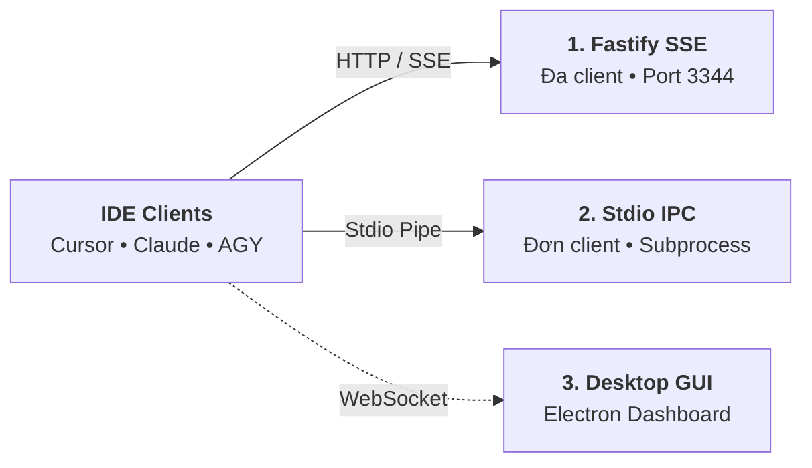

# Các Chế độ Hoạt động (Runtime Execution Modes)

Aevum OS được thiết kế theo kiến trúc phi tập trung, hỗ trợ 3 chế độ hoạt động linh hoạt tùy thuộc vào môi trường phát triển của kỹ sư:



---

## 1. Chế độ Server-Sent Events (SSE Mode) — Khuyến nghị

Đây là chế độ mạnh mẽ nhất của Aevum OS. Hệ thống chạy như một máy chủ HTTP/SSE độc lập trên nền tảng **Fastify v5**, lắng nghe trên cổng `3344`.

```bash
# Khởi động Daemon ở chế độ SSE
aevum --transport sse --port 3344 --workspace /path/to/project
```

### Tại sao nên dùng SSE Mode?
* **Đa Client Đồng thời**: Một Daemon duy nhất có thể phục vụ cùng lúc Cursor, Claude Desktop, Antigravity IDE và Web UI mà không bị khóa tài nguyên.
* **Tách rời Vòng đời**: Khi bạn khởi động lại IDE hoặc đổi cửa sổ làm việc, bộ nhớ của Daemon vẫn được giữ nguyên vẹn 100%, không bị reset bộ nhớ tạm.
* **Tự động Dò Cổng (Port Fallback)**: Nếu cổng `3344` bị chiếm dụng bởi tiến trình khác, Aevum sẽ tự động thăm dò cổng kế tiếp (`3345`, `3346`...) và cập nhật tệp `.aevum/signal.json`.
* **API REST Bổ trợ**: Cung cấp sẵn các endpoint `/api/ping`, `/api/health`, `/api/telemetry` để tích hợp vào công cụ giám sát nội bộ.

---

## 2. Chế độ Standard I/O (Stdio Mode)

Trong chế độ này, IDE (như Cursor hoặc Claude Desktop) trực tiếp khởi tạo và quản lý Aevum như một tiến trình con (child process), giao tiếp thông qua hai luồng `stdin` và `stdout`.

```bash
# Khởi chạy chế độ Stdio
aevum --transport stdio --workspace /path/to/project
```

### Khi nào nên dùng Stdio Mode?
* Môi trường mạng bị giới hạn bởi tường lửa công ty, không cho phép mở cổng HTTP nội bộ (localhost port restrictions).
* Bạn muốn tiến trình Aevum tự động tắt ngay khi đóng cửa sổ IDE để tiết kiệm tuyệt đối RAM trên máy cấu hình khiêm tốn.

---

## 3. Chế độ Giao diện Máy tính để bàn (Desktop Control Center)

Khởi chạy ứng dụng đồ họa độc lập chạy trên khung nền Electron, tích hợp trực tiếp với Fastify Core qua kênh WebSocket nhị phân:

```bash
aevum gui
```

### Các Không gian Làm việc Trực quan:
1. **Workspace Overview**: Quản lý cây kiến trúc Domain/Feature, theo dõi chỉ số sức khỏe codebase và xem log hoạt động thời gian thực (Circular Ring Buffer).
2. **Agent Chat View**: Giao tiếp trực tiếp với Persona thông qua bộ chọn mô hình linh hoạt (**Dynamic Model Selector**): Gemini 3.7 Flash, Claude 3.5 Sonnet, GPT-4o.
3. **Research Skill Tree (Dagre & React Flow)**: Khám phá đồ thị kỹ năng, cây phân nhánh nghiên cứu đệ quy và trạng thái tinh thông của dự án.
4. **Architecture Canvas**: Bảng vẽ tương tác biểu diễn cấu trúc topo của hệ thống hỗ trợ zoom, pan và lọc theo domain.

---

## Bảng So sánh Chi tiết các Chế độ

| Tiêu chí so sánh | Fastify SSE Mode | Stdio IPC Mode | Desktop Control Center |
|---|---|---|---|
| **Cơ chế Giao tiếp** | HTTP Server-Sent Events | Standard In/Out Pipe | IPC + WebSocket nhị phân |
| **Số lượng IDE kết nối** | Đa Client Không Giới Hạn | Đơn Client (1:1 với IDE) | Độc lập (kèm Agent Chat) |
| **Tính bền vững Ký ức** | Vĩnh viễn (sống độc lập IDE) | Theo vòng đời cửa sổ IDE | Vĩnh viễn |
| **Tiêu tốn Tài nguyên** | Cực thấp (~45MB RAM) | Siêu thấp (~35MB RAM) | Tiêu chuẩn GUI (~120MB RAM) |
| **Khả năng Giám sát** | Log qua Terminal / REST | Log qua Debug Console | Đồ thị trực quan + Live Log Canvas |
