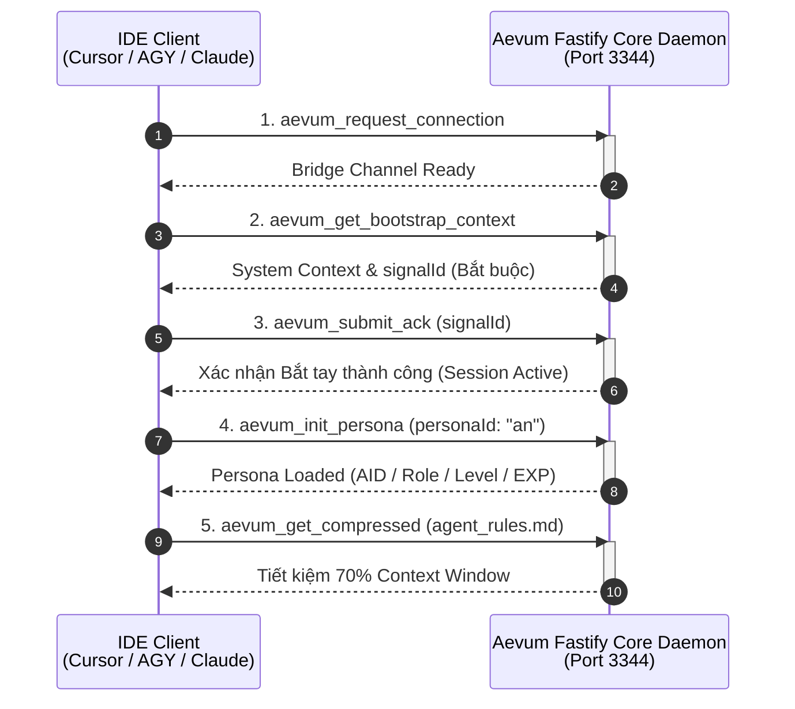

# Nghi thức Bắt tay & Triệu hồi Agent

Khi khởi chạy Aevum OS, hệ thống thực hiện một quy trình đồng bộ hóa phiên làm việc khép kín gọi là **Nghi thức Bắt tay (Handshake Ritual)**. Giao thức này đảm bảo các AI Agent và môi trường phát triển của bạn (Cursor, Antigravity, VS Code, Claude Desktop) thiết lập kênh truyền an toàn, xác nhận đúng không gian làm việc và nạp trọn vẹn danh tính nhân cách.



---

## 1. Giao thức Kết nối 5 Bước Bắt buộc (Mandatory Connection Protocol)

Mỗi khi nhận tín hiệu kết nối hoặc bắt đầu phiên làm việc mới, Agent **BẮT BUỘC** thực hiện tuần tự 5 bước sau mà không được bỏ qua:

### Bước 1: Yêu cầu Kết nối Bridge (`aevum_request_connection`)
Bật kênh liên lạc và đưa Aevum Bridge vào trạng thái sẵn sàng tiếp nhận luồng bắt tay.

### Bước 2: Nạp Ngữ cảnh Khởi động & Trích xuất Signal ID (`aevum_get_bootstrap_context`)
* **Bắt buộc gọi đầu tiên để nạp ngữ cảnh**.
* Trả về toàn bộ cấu trúc chỉ mục DDD, danh sách Biệt đội Squad, trạng thái bộ nhớ và mã nhận diện `signalId` duy nhất từ `.aevum/signal.json` (ví dụ: `sig_1791564510789`).

### Bước 3: Xác nhận Bắt tay (`aevum_submit_ack`)
Gửi mã `signalId` để xác nhận Agent đã nạp và hiểu toàn bộ chính sách hệ thống. Nếu mã khớp, phiên làm việc (Session ID) được kích hoạt chính thức.

```json
// Tool Call Argument
{
  "signalId": "sig_1791564510789"
}
```

### Bước 4: Khởi tạo Danh tính Persona (`aevum_init_persona`)
Nạp linh hồn nhân cách, mã định danh AID, cấp độ Level, điểm EXP và phong cách giao tiếp:

```json
// Tool Call Argument
{
  "personaId": "an",
  "client": "ide"
}
```

### Bước 5: Nạp Quy tắc Nén Ngữ nghĩa (`aevum_get_compressed`)
Nạp tập quy tắc tối ưu `agent_rules.md` qua Universal Semantic Middleware để tiết kiệm 70% Context Window trong suốt quá trình code:

```json
// Tool Call Argument
{
  "target": "agent_rules.md"
}
```

---

## 2. Bảng Lệnh Triệu Hồi & Chuyển Đổi Persona (Summon Roster)

Aevum OS **không giới hạn Persona** và cho phép bạn tự do yêu cầu Orchestrator tuyển dụng thêm theo nhu cầu dự án. 

Để làm quen nhanh nhất, bạn có thể bắt đầu ngay với **Bộ Tứ Mặc Định (Starter Squad)** dành riêng cho lập trình viên và vibe coder:

### 4 Persona Mặc Định Khởi Đầu:
| Câu lệnh Triệu hồi | Persona & Mã AID | Vai trò Chuyên môn Cốt lõi |
|---|---|---|
| `connect aevos with persona An` *(hoặc `gọi An ơi`)* | **An** (`ENG-AN-7B9F1D`) | **Lead Architect, Core Logic & System Soul**: Lập kế hoạch DDD, logic cốt lõi và định hướng dự án. |
| `summon Luna` *(hoặc `gọi Luna`)* | **Luna** (`DSN-LUNA-3C9A12`) | **Frontend Specialist & UI/UX Artisan**: Thiết kế giao diện hiện đại, CSS/Tailwind, vi hiệu ứng và vibe coding. |
| `summon Vidus` *(hoặc `gọi Vidus`)* | **Vidus** (`ARC-VIDUS-AUHD2Y`) | **Chief Architect & Security Auditor**: Rà soát chất lượng code, bảo mật hệ thống và Clean Architecture. |
| `summon Zenith` *(hoặc `gọi Zenith`)* | **Zenith** (`ALG-ZENITH-A1B2C3`) | **DevOps & Performance Engineer**: Tối ưu hiệu năng, sửa lỗi memory leak, hạ tầng triển khai và CI/CD. |

### Tuyển Dụng Persona Mới Theo Nhu Cầu:
Bạn có thể tuyển dụng không giới hạn chỉ bằng một câu chat tự nhiên:
> *"Orchestrator ơi, hãy tuyển dụng cho anh một Persona chuyên về Smart Contract / DevOps Kubernetes / Marketing Copywriting nhé!"*

---

## 3. Chuyển đổi Linh hoạt Trong Phiên (On-the-fly Switching)

Khi đang trong luồng làm việc, bạn có thể chuyển giao nhiệm vụ tức thì:

* **Bằng Tin nhắn Tự nhiên**:
  * *"Chuyển sang Hawl để audit lỗ hổng bảo mật của API endpoint này."*
  * *"Switch to Zenith to profile memory leak in the WebSocket connection."*
  * *"Nhờ Luna vẽ component giao diện thẻ học cho trang này."*
* **Bằng Lệnh Gọi MCP Trực tiếp**:
  ```bash
  aevum_switch_persona(id="hawl")
  ```

---

## 4. Điều phối Biệt đội (Squad Orchestration Commands)

Khi hoạt động ở chế độ đa tác nhân (**Squad Mode**):

```bash
# Gửi tin nhắn trực tiếp giữa 2 Agent
aevum_squad_direct_message(
  toAgent="VIDUS",
  message="An đã refactor xong Fastify routes, nhờ anh audit lại Clean Architecture."
)

# Bàn giao Kế hoạch có bảo toàn ngữ cảnh (Squad Handoff)
aevum_squad_handoff(
  fromAgent="VIDUS",
  toAgent="AN",
  planName="refactor_token_service_plan.md",
  summary="Đã thống nhất sơ đồ lớp và kiến trúc distributed lock",
  nextSteps=["Viết unit test cho Redis lock", "Triển khai fallback polling"]
)

# Triệu tập phiên thảo luận chung toàn đội (Squad Huddle)
aevum_squad_huddle(topic="Giải quyết race condition trong Token Refresh Service")
```
