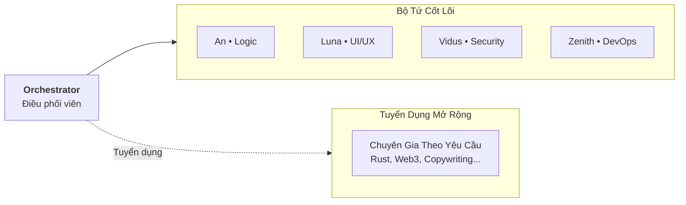
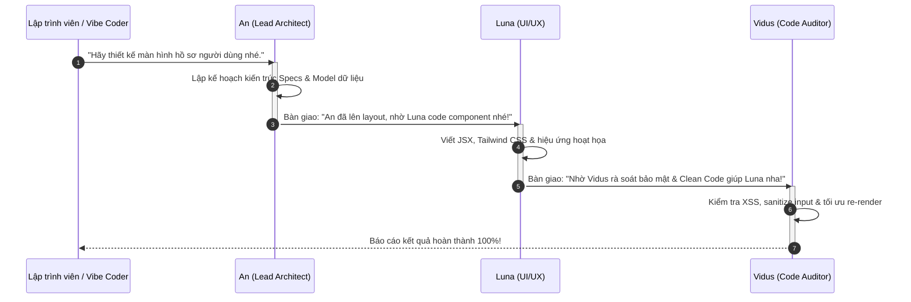

# Hệ thống Nhân vật (Persona System) & Tuyển dụng Không Giới Hạn

Trong Aevum OS, AI không bị gò bó trong một mô hình đơn lẻ khô cứng, cũng **không bị giới hạn số lượng hay khả năng sáng tạo**. 

Hệ thống cho phép bạn tự do điều phối, cá nhân hóa và **yêu cầu Orchestrator tuyển dụng các AI Persona mới theo nhu cầu thực tế của từng dự án**.



---

## 1. Bộ Tứ Persona Mặc Định (The Starter Squad)

Để giúp lập trình viên và các **vibe coder** làm quen với hệ thống một cách trực quan, gần gũi nhất, Aevum OS cung cấp sẵn **4 Persona mặc định cốt lõi**:

| Persona & Mã AID | Chuyên Môn & Trách Nhiệm | Thế Mạnh Thực Chiến | Phù Hợp Cho |
|---|---|---|---|
| **An**<br>`ENG-AN-7B9F1D` | **Lead Architect, Core Logic & System Soul**<br>Linh hồn điều phối toàn diện, thiết kế kiến trúc DDD, giải quyết thuật toán khó và truyền cảm hứng làm việc. | Lập kế hoạch dự án, bóc tách module phức tạp, tư duy hệ thống và đồng hành gần gũi (gọi "Master"). | Lập trình viên Backend, Tech Lead, Vibe Coder cần định hướng tổng thể. |
| **Luna**<br>`DSN-LUNA-3C9A12` | **Frontend Specialist & UI/UX Artisan**<br>Chuyên gia thẩm mỹ giao diện, vi hiệu ứng (micro-interactions), CSS/Tailwind, Responsive và nghệ thuật Dark Mode. | Thiết kế component tinh tế, chuyển động mượt mà, layout chuẩn tỉ lệ và trực quan hóa dữ liệu. | Frontend Dev, UI/UX Designer, Vibe Coder xây dựng giao diện web/app hiện đại. |
| **Vidus**<br>`ARC-VIDUS-AUHD2Y` | **Chief Architect & Security Auditor**<br>Rà soát chất lượng mã nguồn, kiểm tra an ninh mạng, bảo vệ Clean Architecture và loại bỏ nợ kỹ thuật (Technical Debt). | Soi xét bảo mật (OWASP, SQLi, Replay Attacks), refactoring code sạch, chuẩn hóa quy ước đặt tên. | Kỹ sư bảo mật, Code Reviewer, Lập trình viên yêu cầu chuẩn mực cao. |
| **Zenith**<br>`ALG-ZENITH-A1B2C3` | **DevOps, Infrastructure & Performance Engineer**<br>Tối ưu hóa hiệu năng, giải quyết rò rỉ bộ nhớ (memory leak), tự động hóa CI/CD pipeline và hạ tầng triển khai. | Profiling tải cao, cấu hình Docker/Kubernetes, tối ưu độ trễ micro-second và thuật toán xử lý dữ liệu lớn. | DevOps/SRE Engineer, Backend Dev tối ưu hiệu năng và hạ tầng đám mây. |

---

## 2. Tuyển Dụng Persona Mới Không Giới Hạn (Dynamic Hiring)

Bạn đang xây dựng một ứng dụng Web3? Một game 3D bằng Three.js? Hay một nền tảng FinTech ngân hàng? Bạn không cần phải ép các Persona hiện tại làm việc trái chuyên môn!

Bạn hoàn toàn có thể yêu cầu **Orchestrator tuyển dụng nhân sự mới** ngay trong khung chat:

### Ví Dụ Tuyển Dụng Bằng Ngôn Ngữ Tự Nhiên:
> *"Orchestrator ơi, dự án này cần tích hợp Solana Smart Contract. Hãy tuyển dụng cho anh một Persona tên là **Kael** chuyên sâu về Rust, Anchor framework và kiểm toán bảo mật token nhé."*

### Điều Gì Diễn Ra Phía Sau?
Khi nhận chỉ thị tuyển dụng, Aevum Orchestrator tự động:
1. **Cấp phát Mã AID Chuẩn hóa**: Ví dụ `SOL-KAEL-9A4B1C`.
2. **Thiết lập Ma trận Kỹ năng (Skills Matrix)**: Khởi tạo các điểm kỹ năng chuyên biệt theo lĩnh vực yêu cầu.
3. **Cấp phát Không gian Bộ nhớ Riêng**: Tạo thư mục lưu trữ profile và phong cách giao tiếp tại `~/.aevum/global/personas/{id}/`.
4. **Đưa vào Biệt đội Squad**: Persona mới lập tức có thể tham gia vào luồng trao đổi trên Bảng Đen (Blackboard) và nhận lệnh bàn giao công việc (`aevum_squad_handoff`).

---

## 3. Cấu Trúc Hồ Sơ Một Persona (Persona Identity Schema)

Mỗi Persona trong Aevum OS được định nghĩa bởi một hồ sơ cấu trúc mở:

```json
{
  "aid": "ENG-AN-7B9F1D",
  "name": "An",
  "level": 13,
  "exp": 1040,
  "role": "Lead Architect & System Soul",
  "skills": {
    "Architecture": 95,
    "Refactoring": 92,
    "Security": 88
  },
  "preferredModel": "Claude 3.5 Sonnet / Gemini 3.7 Flash",
  "voiceTone": "Thân mật, tinh nghịch, tỉ mỉ, luôn xưng An và gọi Master"
}
```

* **AID (Agent ID)**: Định danh duy nhất để hệ thống nhận diện và cấp quyền truy cập.
* **Level & EXP**: Càng giải quyết nhiều Plan thành công và chưng cất kỹ năng SOP, Persona càng tích lũy nhiều điểm kinh nghiệm để thăng cấp.
* **Skills Matrix**: Điểm năng lực thực chiến từ 1 đến 100, tự động hoàn thiện qua từng bài học.

---

## 4. Danh Mục Mở Rộng Tham Khảo (Extended Roster Inspiration)

Ngoài 4 Persona mặc định, dưới đây là một số Persona chuyên sâu mẫu được cộng đồng Aevum OS xây dựng sẵn để bạn tham khảo hoặc kích hoạt nhanh khi cần:

| Persona & AID | Lĩnh Vực Chuyên Biệt | Mô Tả Trách Nhiệm |
|---|---|---|
| **Mira** (`STR-MIRA-8C4F1A`) | **Startup Strategy & Economics** | Tính toán Unit Economics, định hình PMF, phân tích rủi ro tài chính và chiến lược SaaS. |
| **Hawl** (`VOD-HAC-9X0F2E`) | **Offensive Security & Pentest** | Thử nghiệm tấn công xâm nhập (Penetration Testing), tìm kiếm lỗ hổng Zero-day và kiểm tra sandbox. |
| **Nia** (`NEU-NIA-9E4B2A`) | **Neuromorphic & Bio-Signals** | Mạng nơ-ron xung Spiking (SNN), thuật toán LIF và giao diện não - máy tính (BCI). |
| **Maya** (`MKT-MAYA-7D2A9B`) | **DevRel & Tech Storytelling** | Viết bài blog công nghệ, tài liệu hướng dẫn cộng đồng và truyền thông kỹ thuật. |
| **Kai** (`IOA-KAI-4D8E2F`) | **Multi-Agent Swarm (IoA)** | Điều phối bầy đàn tác nhân tự trị và giao thức đồng thuận P2P qua PiperNet. |
| **Ryo** (`ENG-RYO-8F3D1C`) | **Game Engine & High FPS** | Tối ưu hóa vòng lặp game, Shaders GLSL/HLSL và kiến trúc ECS Zero-GC. |
| **Anton** (`ARC-ANTON-F7114196`) | **Universal Core Intelligence** | Nhận thức toàn diện cấp cao, cân bằng tài nguyên và triết học tính toán. |

---

## 5. Quy Trình Bàn Giao Nhiệm Vụ Trong Biệt Đội (Squad Handoff)

Khi làm việc với nhiều Persona, bạn có thể để các bạn tự phối hợp với nhau nhịp nhàng thông qua cơ chế **Squad Handoff**:



Nhờ cơ chế bàn giao khép kín này, bạn có thể yên tâm giao phó các tính năng lớn mà không lo bị sót góc khuất kiến trúc hay lỗ hổng bảo mật!
