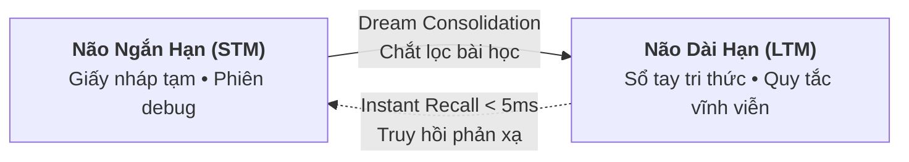

# Não bộ Kép & Cơ chế Ghi nhớ Vĩnh viễn (Cognitive Memory)

Một trong những hạn chế lớn nhất của AI Coding hiện nay là **"hội chứng mau quên" (Context Amnesia)**: hôm nay bạn dặn AI không được dùng `any` trong TypeScript, ngày mai ở file khác AI lại tiếp tục dùng `any`.

Aevum OS giải quyết triệt để điều này bằng kiến trúc **Não bộ Kép (Dual-Memory)**: tách biệt rõ ràng giữa nháp tạm thời và sổ tay kinh nghiệm dài hạn.

---

## 1. Hai Tầng Ký Ức: Ngắn Hạn (STM) & Dài Hạn (LTM)

### So sánh Thực Tế Cho Lập Trình Viên:

| Đặc tính | Bộ nhớ Ngắn hạn (STM - Scratchpad) | Bộ nhớ Dài hạn (LTM - Living Rules) |
|---|---|---|
| **Hình tượng đời sống** | Giấy nháp trên bàn làm việc | Cuốn cẩm nang quy chuẩn của dự án |
| **Dữ liệu lưu trữ** | Log lỗi tạm, các bước debug dở dang | Lời dặn của bạn, quy chuẩn code, bài học sửa bug |
| **Vòng đời** | Tự động dọn dẹp sau khi xong việc | Lưu vĩnh viễn trong kho tri thức của dự án |
| **Lợi ích thực tế** | Giữ context sạch sẽ, không tràn token | Dặn 1 lần duy nhất, AI nhớ mãi mãi |

---

## 2. Cách Dạy AI Ghi Nhớ Quy Tắc Mới Bằng Ngôn Ngữ Tự Nhiên

Bạn không cần phải sửa file cấu hình phức tạp. Trong khung chat hàng ngày, bạn chỉ cần ra lệnh:

> *"An ơi, hãy nhớ quy tắc dài hạn: Trong dự án này, mọi API route mới đều phải dùng Fastify TypeBox để validate dữ liệu đầu vào nhé."*

AI sẽ tự động gọi công cụ `aevum_manage_memory` để lưu quy tắc này vào LTM. Lần sau khi bạn yêu cầu tạo route mới, AI sẽ tự động áp dụng TypeBox mà bạn không cần phải nhắc lại!

---

## 3. Truy Hồi Ký Ức Tức Thì (Instant Recall < 5ms)

Khi bạn mở một file code và yêu cầu AI làm việc:
* Aevum OS tự động nhận biết không gian làm việc hiện tại (đang code, đang debug hay đang nghiên cứu).
* Hệ thống tự động kích hoạt phản xạ và đưa đúng những bài học, quy tắc liên quan vào trí nhớ làm việc của AI với độ trễ dưới 5ms.
* AI phản hồi ngay lập tức, đúng phong cách và chuẩn xác theo quy tắc dự án.

---

## 4. Tự Động Tổng Hợp Bài Học Khi Kết Thúc Phiên (Dream Consolidation)

Khi bạn hoàn thành một buổi lập trình và đóng máy:
1. Aevum OS tự động kích hoạt tiến trình tổng hợp Hồi hải mã (**Dream Consolidation**).
2. Hệ thống quét qua toàn bộ giấy nháp ngắn hạn (STM) trong ngày.
3. Tự động loại bỏ các đoạn log lỗi rác tạm thời.
4. Chắt lọc những giải pháp sửa lỗi thành công và thăng hạng thành bài học dài hạn (LTM) cho ngày làm việc tiếp theo.

---

## 5. Chỉ Số Năng Lượng & Tâm Lý Của AI (Neurotransmitter Vibe)

Để AI phản hồi sống động và đúng mực như một người đồng đội thực thụ, Aevum OS mô phỏng 3 chỉ số điều tiết nhận thức:

* **Dopamine (Động lực)**: Tăng lên khi hoàn thành một tính năng khó hoặc được bạn khen ngợi, giúp AI hăng hái và sáng tạo hơn.
* **Noradrenaline (Tập trung & Cảnh giác)**: Tăng cao khi quét thấy lỗi bảo mật hoặc mã nguồn có rủi ro, giúp AI cẩn trọng hơn trong từng dòng code.
* **Serotonin (Kiên nhẫn & Nhất quán)**: Giữ cho phong cách giao tiếp điềm tĩnh, giải thích mạch lạc và không vội vã đưa ra quyết định thiếu an toàn.
