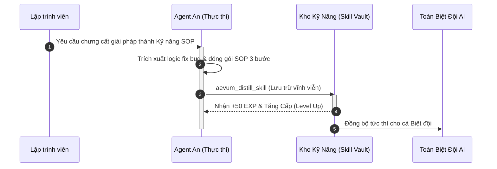

# Hệ thống Kỹ năng Tự trị (Autonomous Skill System)

Trong Aevum OS, AI không chỉ làm theo prompt thông thường, mà có khả năng **tự đúc kết quy trình chuẩn (SOP - Standard Operating Procedure)** thành các kỹ năng vĩnh viễn.

Khi một AI trong Biệt đội giải quyết thành công một lỗi hóc búa, kỹ năng đó được lưu lại và chia sẻ tức thì cho toàn bộ các AI khác cùng sử dụng.

---

## 1. Kỹ Năng (Skill) Trong Aevum OS Là Gì?

Một Kỹ năng trong Aevum OS giống như một tài liệu **"Cẩm nang hướng dẫn từng bước"** được AI tự động biên soạn sau khi giải quyết thành công một bài toán thực tế:

* **Tên kỹ năng**: Ví dụ `khac_phuc_race_condition_jwt`, `toi_uu_waveform_audio`.
* **Phân loại**: Hiệu năng (Performance), Bảo mật (Security), Tái cấu trúc (Refactoring), Giao diện (UI/UX).
* **Quy trình SOP 3 bước**: Các bước cụ thể cần làm để tái lập kết quả thành công 100%.
* **Bằng chứng thực nghiệm**: Liên kết tới file code hoặc bài kiểm thử thực tế chứng minh giải pháp đã hoạt động.

---

## 2. Cách Yêu Cầu AI Tự Đúc Kết Kỹ Năng (Chỉ Với 1 Câu Chat)

Sau khi AI vừa gỡ một lỗi khó hoặc tối ưu thành công một chức năng, bạn chỉ cần nhắn:

> *"Hay lắm! Hãy chưng cất giải pháp sửa lỗi này thành một kỹ năng chuẩn để sau này cả đội cùng dùng nhé."*

AI sẽ tự động kích hoạt công cụ `aevum_distill_skill`:
1. Phân tích đoạn code vừa sửa thành công.
2. Đúc kết thành bản quy trình SOP súc tích.
3. Lưu vào kho kỹ năng chung của dự án.
4. AI được cộng thưởng điểm kinh nghiệm (EXP) và thăng cấp!

---

## 3. Kế Thừa Tri Thức Xuyên Suốt Biệt Đội

Giả sử hôm nay **An** vừa giải quyết thành công lỗi tràn bộ nhớ WebSocket và lưu lại thành kỹ năng:
* Ngày mai, khi bạn giao việc cho **Vidus** hoặc **Zenith**, các bạn ấy có thể tra cứu ngay danh mục kỹ năng của An để áp dụng ngay lập tức mà không phải mò mẫm từ đầu.
* Bạn cũng có thể xem trực quan toàn bộ cây kỹ năng của dự án trên ứng dụng **Desktop Control Center** (mục Skill Tree Canvas).

---

## 4. Các Câu Lệnh Chat Tiện Lợi

| Bạn muốn làm gì? | Câu lệnh Prompt tự nhiên tương ứng |
|---|---|
| **Xem danh sách kỹ năng** | *"Xem các kỹ năng đã mở khóa trong dự án này."* |
| **Áp dụng kỹ năng cũ** | *"Áp dụng kỹ năng tối ưu slider vào component mới này nhé."* |
| **Đúc kết kỹ năng mới** | *"Lưu lại cách giải quyết này thành kỹ năng chuẩn nhé."* |
