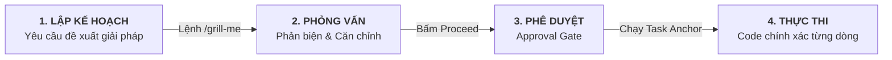

# Quản trị Vòng đời Kế hoạch (Plan Lifecycle)

Nguyên tắc vàng khi làm việc với AI Coding Agent trong Aevum OS: **Luôn có Kế hoạch trước khi viết code (Plan-First)**. 

Việc yêu cầu AI lập kế hoạch trước giúp loại bỏ hoàn toàn tình trạng AI "tự ý phán đoán", sửa nhầm logic hiện có hoặc viết code nửa chừng rồi bỏ dở.

---

## 1. Quy Trình 4 Bước Đơn Giản Cho Developer



### Bước 1: Yêu Cầu Lập Kế Hoạch (Drafting)
Trước khi làm tính năng lớn hoặc refactor mã nguồn, bạn chỉ cần ra lệnh:
> *"Lập kế hoạch chuyển đổi route authentication sang Fastify v5 nhé."*

AI sẽ khảo sát codebase và tạo ra một file kế hoạch (`implementation_plan.md`) liệt kê rõ: mục tiêu, các file cần sửa, rủi ro tiềm ẩn và các bước thực hiện.

### Bước 2: Phỏng Vấn & Phản Biện (The Grill Session)
Nếu muốn thử thách xem phương án của AI đã thực sự tối ưu chưa, bạn chỉ cần gõ:
```text
/grill-me
```
AI sẽ đóng vai trò một Tech Lead giàu kinh nghiệm, đặt ra 2-3 câu hỏi then chốt (ví dụ: *"Khi traffic tăng gấp 10 lần thì phương án này có bị nghẽn không?", "Có cần phương án fallback khi Redis sập không?"*) để hai bên cùng thống nhất giải pháp hoàn hảo nhất.

### Bước 3: Phê Duyệt Kế Hoạch (Approval Gate)
Khi bạn hài lòng với bản kế hoạch:
* Bấm nút **Proceed** ngay trên giao diện IDE (Antigravity / Cursor).
* Hoặc gõ *"Duyệt, tiến hành làm đi em"*.
AI mới chính thức bắt tay vào viết code.

### Bước 4: Thực Thi & Gắn Kết Từng Dòng Code (Task Anchoring)
Mỗi đầu việc trong kế hoạch được gắn trực tiếp với file và dòng code thực tế:
```markdown
- [x] [src/auth/service.ts:45] Bổ sung kiểm tra token hết hạn
- [ ] [src/auth/route.ts:80] Cập nhật handler trả về mã lỗi 401 chuẩn
```
Bạn luôn theo dõi được AI đang làm đến đâu theo thời gian thực mà không sợ mất dấu.

---

## 2. Cầu Nối Hai Chiều Tự Động (Dual-Plan Auto-Bridge)

Bạn không cần phải copy-paste kế hoạch đi đâu cả:
* Khi bạn hoặc AI tạo file `implementation_plan.md` trong IDE, Aevum OS tự động nhận biết và phản chiếu kế hoạch lên bảng điều khiển **Desktop Control Center**.
* Tiến độ hoàn thành các checkbox được đồng bộ 1:1 theo thời gian thực.
* Khi toàn bộ các bước hoàn tất, AI tự động lưu lại bài học vào bộ nhớ dự án và nhận điểm thưởng EXP!
