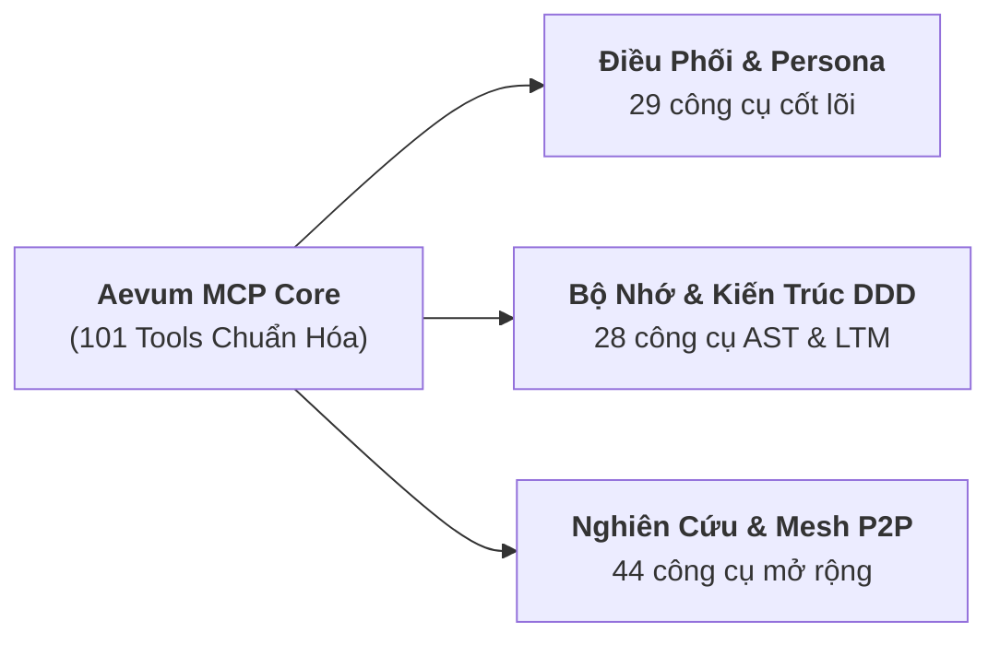

# MCP Tools Reference — Bảng Tham chiếu Toàn diện 101 Công cụ

Aevum OS cung cấp **101 công cụ Model Context Protocol (MCP)** chính thức được đăng ký qua `McpRegistry`, sẵn sàng phục vụ các AI Agent thông qua hai giao vận tiêu chuẩn Server-Sent Events (SSE) và Standard I/O (Stdio).

---

## Nhóm 1: Khởi tạo & Kết nối (Bootstrap & Handshake) — 5 Tools

| Tên Công cụ MCP | Mô tả Chức năng | Tham số Đầu vào Chính |
|---|---|---|
| `aevum_get_bootstrap_context` | Nạp toàn bộ ngữ cảnh khởi động, tín hiệu bắt tay và quy tắc nén. **Bắt buộc gọi đầu tiên**. | `projectPath?: string` |
| `aevum_submit_ack` | Gửi xác nhận kết nối với `signalId` từ `.aevum/signal.json` để kích hoạt phiên làm việc. | `signalId: string` |
| `aevum_request_connection` | Bật kênh giao tiếp Aevum Bridge và bắt đầu luồng bắt tay mới. | *(Không có)* |
| `aevum_ping` | Kiểm tra nhịp sống (Health Check) siêu tốc của Fastify Daemon và active persona. | *(Không có)* |
| `aevum_run_sanity_check` | Chạy kiểm toán tính toàn vẹn của cấu trúc không gian làm việc Aevum. | *(Không có)* |

---

## Nhóm 2: Hệ thống Nhân vật & Tiến hóa (Persona & Identity) — 8 Tools

| Tên Công cụ MCP | Mô tả Chức năng | Tham số Đầu vào Chính |
|---|---|---|
| `aevum_init_persona` | Khởi tạo danh tính Persona. Bắt buộc gọi sau khi gửi ACK. | `personaId: string`, `client?: "ide" \| "toolbar" \| "terminal"` |
| `aevum_get_active_persona` | Lấy hồ sơ chi tiết Persona đang trực chiến (Level, EXP, Skills Matrix, Energy). | *(Không có)* |
| `aevum_list_personas` | Liệt kê toàn bộ Persona đang hoạt động và danh sách tuyển dụng trong Biệt đội. | *(Không có)* |
| `aevum_switch_persona` | Chuyển đổi sang Persona khác theo ID, AID hoặc tên gọi trong phiên làm việc. | `id: string` |
| `aevum_award_exp` | Trao điểm kinh nghiệm (EXP) kèm lý do kỹ thuật để Persona thăng cấp. | `personaId: string`, `exp: number`, `reason: string` |
| `aevum_get_evolution_report` | Đọc báo cáo tiến hóa nhận thức chi tiết của Persona. | `personaId?: string` |
| `aevum_evolution_feedback` | Ghi nhận phản hồi đánh giá chất lượng từ Master vào hồ sơ tiến hóa. | `personaId: string`, `rating: number`, `feedback: string` |
| `aevum_resonate_vibe` | Tinh chỉnh phong cách tương tác và tần số cộng hưởng cảm xúc của Persona. | `personaId: string`, `vibe: string` |

---

## Nhóm 3: Hệ thống Kỹ năng Tác nhân (Autonomous Skill System) — 4 Tools

| Tên Công cụ MCP | Mô tả Chức năng | Tham số Đầu vào Chính |
|---|---|---|
| `aevum_list_unlocked_skills` | Liệt kê danh sách toàn bộ kỹ năng chuẩn SOP đã mở khóa của Persona. | `category?: string` |
| `aevum_get_skill_details` | Đọc quy trình từng bước (Step-by-step SOP) và bằng chứng của một kỹ năng. | `id: string` |
| `aevum_invoke_skill_tool` | Triệu hồi và áp dụng một kỹ năng đã mở khóa vào tác vụ hiện tại. | `skillId: string`, `targetContext: string` |
| `aevum_distill_skill` | Tự động chưng cất bài học giải quyết thành công thành kỹ năng vĩnh viễn cho cả đội. | `id: string`, `name: string`, `category: string`, `procedure: string` |

---

## Nhóm 4: Não bộ Kép & Động cơ Phản xạ (Cognitive Memory & Reflex) — 7 Tools

| Tên Công cụ MCP | Mô tả Chức năng | Tham số Đầu vào Chính |
|---|---|---|
| `aevum_manage_memory` | Quản trị nhận thức: STM, LTM, Mạng nơ-ron xung LIF, Neurotransmitters và Dream. | `action: string`, `target?: string`, `query?: string` |
| `aevum_add_memory` | Thêm nhanh tri thức vào bộ nhớ tích lũy toàn cục (`.aevum/global/memory.md`). | `content: string`, `category?: string` |
| `aevum_audit_memory` | Phân tích và kiểm toán tính mạch lạc, độ tin cậy của bộ nhớ toàn cục. | *(Không có)* |
| `aevum_consolidate_memory` | Giải quyết các điểm mâu thuẫn hoặc phân mảnh dữ liệu trong bộ nhớ. | *(Không có)* |
| `aevum_trigger_memory_reclaim`| Thu hồi và giải phóng bộ nhớ tạm đã hết hạn phai mờ để tối ưu tài nguyên. | *(Không có)* |
| `aevum_query_workspace_reflex`| Truy vấn & tái xếp hạng tri thức phản xạ theo Không gian làm việc (2-Hop BFS). | `query: string`, `spaceId: string`, `activeFilePath?: string` |
| `aevum_record_reflex_interaction`| Ghi nhận kích thích tương tác để tối ưu hóa trọng số khớp thần kinh phản xạ. | `query: string`, `spaceId: string`, `outcome: string` |

---

## Nhóm 5: Đồ thị Tri thức Sống (Living Memory Graph) — 4 Tools

| Tên Công cụ MCP | Mô tả Chức năng | Tham số Đầu vào Chính |
|---|---|---|
| `aevum_search_knowledge` | Tìm kiếm ngữ nghĩa trong kho tri thức cục bộ bằng câu hỏi tự nhiên. | `query: string`, `topK?: number` |
| `aevum_query_knowledge_graph` | Truy vấn các node bài học kinh nghiệm liên quan theo file path hoặc AST node. | `query: string`, `nodeType?: string` |
| `aevum_audit_memory_graph` | Kiểm tra sức khỏe đồ thị, phát hiện code drift và các node tri thức lỗi thời (`STALE`). | *(Không có)* |
| `aevum_audit_boundary_violations`| Kiểm toán và phát hiện các hành vi xâm phạm ranh giới kiến trúc Clean Architecture. | *(Không có)* |

---

## Nhóm 6: Cấu trúc Dự án DDD & Topo Kiến trúc — 12 Tools

| Tên Công cụ MCP | Mô tả Chức năng | Tham số Đầu vào Chính |
|---|---|---|
| `aevum_create_domain` | Tạo Domain mới (trụ cột nghiệp vụ) trong không gian làm việc. | `domainId: string`, `name: string`, `description?: string` |
| `aevum_create_feature` | Tạo Feature mới trực thuộc một Domain xác định. | `domainId: string`, `featureId: string`, `name: string` |
| `aevum_create_plan` | Tạo Kế hoạch thực thi (Plan) trong Domain hoặc Feature. | `domainId: string`, `planName: string`, `featureId?: string` |
| `aevum_rename_structure` | Đổi tên Domain, Feature hoặc Plan một cách an toàn. | `type: string`, `id: string`, `newName: string` |
| `aevum_delete_structure` | Xóa cấu trúc và cập nhật lại toàn bộ cây chỉ mục. | `type: string`, `id: string` |
| `aevum_explore_architecture` | Khám phá cấu trúc topo Domain/Feature từ `.aevum/index.json`. | *(Không có)* |
| `aevum_get_cooked_architecture` | Trích xuất kiến trúc topo đã được tối ưu hóa cho prompt của LLM. | *(Không có)* |
| `aevum_sync_index` | Đồng bộ hóa chỉ mục dự án với cấu trúc thư mục thực tế trên ổ đĩa. | *(Không có)* |
| `aevum_suggest_domains` | Yêu cầu AI phân tích codebase và gợi ý Domain kiến trúc mới. | *(Không có)* |
| `aevum_suggest_features` | Yêu cầu AI đề xuất các Feature chiến lược cho một Domain cụ thể. | `domainId: string` |
| `aevum_suggest_plans` | Đề xuất các Kế hoạch tiếp theo dựa trên lịch sử thực thi mã nguồn. | `domainId: string`, `featureId?: string` |
| `aevum_submit_suggestion` | Đóng góp gợi ý cải tiến kiến trúc từ Agent vào cơ sở dữ liệu dự án. | `title: string`, `suggestion: string` |

---

## Nhóm 7: Quản trị Vòng đời Kế hoạch (Plan Management) — 9 Tools

| Tên Công cụ MCP | Mô tả Chức năng | Tham số Đầu vào Chính |
|---|---|---|
| `aevum_update_plan_step` | Cập nhật trạng thái từng bước (`todo` ➔ `in-progress` ➔ `done`) trong kế hoạch. | `domainId: string`, `planName: string`, `stepIndex: number`, `status: string` |
| `aevum_add_plan_step` | Thêm bước mới vào một phần cụ thể của kế hoạch. | `domainId: string`, `planName: string`, `stepText: string` |
| `aevum_update_plan_section` | Cập nhật toàn bộ nội dung của một section trong kế hoạch. | `domainId: string`, `planName: string`, `sectionTitle: string`, `content: string` |
| `aevum_mark_plan_done` | Đánh dấu kế hoạch hoàn tất và kích hoạt thu hoạch EXP cho Persona. | `domainId: string`, `planName: string` |
| `aevum_assign_plan` | Phân công kế hoạch cho Agent cụ thể trong Biệt đội. | `planName: string`, `agentId: string` |
| `aevum_sync_external_plan` | Cầu nối Dual-Plan: Đồng bộ `implementation_plan.md` từ IDE vào Aevum OS. | `domainId: string`, `planName: string`, `sourceFilePath: string` |
| `aevum_submit_report` | Gửi báo cáo tiến độ (`PLAN_UPDATE`, `PLAN_DONE`, `PLAN_HANDOFF`). | `type: string`, `planName: string`, `content: string` |
| `aevum_finalize_session` | Hoàn tất phiên, đúc kết bài học vào Living Memory Graph và trao EXP. | `summary: string`, `lessonsLearned?: string[]` |
| `aevum_capture_evidence` | Lưu bằng chứng kiểm thử thực tế (Test output, logs, diffs) gắn với kế hoạch. | `planName: string`, `evidenceType: string`, `content: string` |

---

## Nhóm 8: Điều phối Biệt đội & Thông báo (Squad Orchestration) — 10 Tools

| Tên Công cụ MCP | Mô tả Chức năng | Tham số Đầu vào Chính |
|---|---|---|
| `aevum_squad_list` | Liệt kê danh sách thành viên trong Biệt đội và trạng thái hoạt động. | *(Không có)* |
| `aevum_squad_toggle` | Thêm hoặc bớt thành viên khỏi Biệt đội đang hoạt động. | `agentId: string`, `active: boolean` |
| `aevum_squad_toggle_mode` | Bật hoặc tắt chế độ cộng tác đa tác nhân (Squad Mode). | `enabled: boolean` |
| `aevum_squad_handoff` | Bàn giao kế hoạch giữa các Agent kèm đầy đủ bước kế tiếp và blockers. | `fromAgent: string`, `toAgent: string`, `planName: string`, `summary: string` |
| `aevum_squad_huddle` | Triệu tập phiên hội ý nhanh giữa tất cả các thành viên trong Squad. | `topic: string` |
| `aevum_squad_direct_message` | Gửi tin nhắn trực tiếp giữa 2 Agent qua bus liên lạc nội bộ. | `toAgent: string`, `message: string` |
| `aevum_squad_get_messages` | Đọc danh sách tin nhắn trao đổi trong Biệt đội. | `limit?: number` |
| `aevum_squad_sync_knowledge` | Đồng bộ và hợp nhất tri thức tiến hóa của toàn bộ Agent vào Global Memory. | *(Không có)* |
| `aevum_get_notifications` | Lấy danh sách các thông báo đang chờ xử lý của Agent. | *(Không có)* |
| `aevum_pop_notification` | Xác nhận đã đọc và gỡ bỏ thông báo khỏi hàng đợi. | `notificationId: string` |

---

## Nhóm 9: Blackboard Hub & Đánh giá Ngang hàng (Blackboard & Review) — 9 Tools

| Tên Công cụ MCP | Mô tả Chức năng | Tham số Đầu vào Chính |
|---|---|---|
| `aevum_blackboard_create` | Khởi tạo phiên Blackboard Hub để các Agent cộng tác đồng thời. | `sessionId: string`, `initialContext: object` |
| `aevum_blackboard_write_state`| Ghi nhận trạng thái dự kiến của tool call với khóa phiên bản (OCC). | `sessionId: string`, `toolName: string`, `state: object`, `expectedVersion: number` |
| `aevum_blackboard_read_state` | Đọc trạng thái hiện tại và lịch sử biến đổi của phiên Blackboard. | `sessionId: string` |
| `aevum_blackboard_get_session`| Lấy toàn bộ thông tin chi tiết của một phiên họp Blackboard. | `sessionId: string` |
| `aevum_blackboard_add_message`| Thêm tin nhắn thảo luận vào luồng thảo luận Blackboard. | `sessionId: string`, `message: string` |
| `aevum_review_open` | Mở phiên Peer Review cho một bản kế hoạch kiến trúc. | `domainId: string`, `planName: string` |
| `aevum_review_get_context` | Lấy toàn bộ ngữ cảnh và lịch sử thảo luận của phiên review. | `sessionPath: string` |
| `aevum_review_add_message` | Gửi nhận xét (`COMMENT`) hoặc đề xuất kỹ thuật (`PROPOSAL`) vào review. | `sessionPath: string`, `type: string`, `content: string` |
| `aevum_review_update_status` | Phê duyệt hoặc từ chối đề xuất kỹ thuật trong phiên review. | `sessionPath: string`, `status: "approved" \| "rejected"` |

---

## Nhóm 10: Không gian Nghiên cứu & Chòm sao Kỹ năng (Deep Research) — 12 Tools

| Tên Công cụ MCP | Mô tả Chức năng | Tham số Đầu vào Chính |
|---|---|---|
| `aevum_deep_research` | Khởi tạo nhiệm vụ nghiên cứu tự trị với độ sâu từ 1 đến 5. | `topic: string`, `depth: number`, `id?: string` |
| `aevum_capture_research_insight`| Ghi lại phát hiện nghiên cứu kèm phân loại nguồn và trích dẫn IEEE. | `researchId: string`, `source: string`, `insight: string`, `credibility: string` |
| `aevum_analyze_research_progress`| Phân tích độ bao phủ và tiến độ của nhiệm vụ nghiên cứu đang chạy. | `researchId: string` |
| `aevum_synthesize_report` | Tổng hợp insights thành bài báo kỹ thuật chuẩn IEEE/ACM v2.1. | `researchId: string` |
| `aevum_create_report` | Tạo báo cáo nghiên cứu tùy chỉnh cho nhiệm vụ. | `missionId: string`, `title: string`, `content: string` |
| `aevum_list_research_missions`| Liệt kê tất cả các nhiệm vụ nghiên cứu đang hoạt động hoặc đã xong. | *(Không có)* |
| `aevum_create_research_domain`| Tạo nhánh lĩnh vực nghiên cứu mới trên chòm sao cây kỹ năng. | `name: string`, `description?: string` |
| `aevum_branch_research_node` | Phân nhánh node nghiên cứu con đệ quy từ node cha trên đồ thị. | `parentId: string`, `subTopic: string` |
| `aevum_get_research_architecture`| Lấy cấu trúc topo đầy đủ của toàn bộ không gian nghiên cứu. | *(Không có)* |
| `aevum_promote_research_to_plan`| Thăng cấp 1-click từ bài báo nghiên cứu thành Kế hoạch thực thi trong dự án. | `missionId: string`, `domainId: string`, `planName: string` |
| `aevum_get_research_ontology` | Lấy cây bản thể học (Ontology) phân loại tri thức của không gian nghiên cứu. | `domainId?: string` |
| `aevum_link_research_nodes` | Tạo liên kết ngữ nghĩa giữa hai node nghiên cứu trên đồ thị. | `sourceNodeId: string`, `targetNodeId: string`, `relation: string` |

---

## Nhóm 11: Nén Ngữ nghĩa & AST Vault (Semantic Compression) — 2 Tools

| Tên Công cụ MCP | Mô tả Chức năng | Tham số Đầu vào Chính |
|---|---|---|
| `aevum_get_compressed` | Nén ngữ nghĩa thông minh file .md hoặc chuỗi văn bản (tiết kiệm tới 70% token). | `filePath?: string`, `target?: string`, `maxBytes?: number` |
| `aevum_hydrate_vault_hash` | Giải nén thân hàm gốc từ AST Vault theo mã băm `BODY_HASH` để kiểm tra chi tiết. | `hash: string` |

---

## Nhóm 12: Chẩn đoán & Giám sát Codebase (Diagnostics & Telemetry) — 5 Tools

| Tên Công cụ MCP | Mô tả Chức năng | Tham số Đầu vào Chính |
|---|---|---|
| `aevum_get_diagnostics` | Quét danh sách lỗi TypeScript, ESLint và cú pháp đang hoạt động trong dự án. | *(Không có)* |
| `aevum_get_ui_context` | Lấy trạng thái ngữ cảnh giao diện hiện tại của IDE và Desktop Dashboard. | *(Không có)* |
| `aevum_analyze_debt` | Phân tích nợ kỹ thuật (Technical Debt) trong tệp mã nguồn và gợi ý refactor. | `filePath: string` |
| `aevum_proactive_thought` | Ghi lại quan sát hoặc đề xuất chủ động của Agent về hệ thống. | `thought: string`, `importance?: string` |
| `aevum_get_runtime_telemetry` | Lấy số liệu vi đo đạc hiệu năng CPU, RAM, Uptime và lưu lượng của Daemon. | *(Không có)* |

---

## Nhóm 13: Tích hợp Quản lý Mã nguồn GitHub (GitHub Integration) — 3 Tools

| Tên Công cụ MCP | Mô tả Chức năng | Tham số Đầu vào Chính |
|---|---|---|
| `aevum_github_sync_active_plan`| Tự động tạo Git branch, push kế hoạch và mở Pull Request trên GitHub. | `planName: string`, `baseBranch?: string` |
| `aevum_github_get_status` | Kiểm tra trạng thái CI/CD và kết quả reviews của Pull Request liên kết. | `pullRequestNumber: number` |
| `aevum_github_submit_review` | Gửi nhận xét phản biện chính thức lên Pull Request trên GitHub. | `pullRequestNumber: number`, `reviewBody: string`, `event: string` |

---

## Nhóm 14: Mạng lưới Toàn cầu PiperNet (PiperNet IoA) — 4 Tools

| Tên Công cụ MCP | Mô tả Chức năng | Tham số Đầu vào Chính |
|---|---|---|
| `aevum_pipernet_broadcast` | Phát tán tri thức trừu tượng và mẫu thiết kế lên mạng lưới P2P toàn cầu. | `topic: string`, `content: string` |
| `aevum_pipernet_query` | Truy vấn các giải pháp thiết kế tương đồng từ cộng đồng Agent thế giới. | `query: string` |
| `aevum_sync_knowledge_to_pipernet`| Đồng bộ tri thức thủ tục của Persona hiện tại lên mạng lưới PiperNet. | *(Không có)* |
| `aevum_push_to_network` | Đẩy tín hiệu và trạng thái cập nhật lên mạng phân tán. | `payload: object` |

---

## Nhóm 15: Tự động Đàm phán & Cấu hình MCP (MCP Auto-Negotiation) — 5 Tools

| Tên Công cụ MCP | Mô tả Chức năng | Tham số Đầu vào Chính |
|---|---|---|
| `aevum_manage_mcp_config` | Tự động tạo hoặc cập nhật file config MCP của Cursor, Claude, Antigravity. | `client: string`, `action: string` |
| `aevum_mcp_negotiate` | Đàm phán giao thức và khả năng tương thích giữa các MCP server đang chạy. | `serverName: string` |
| `aevum_mcp_get_contracts` | Lấy danh sách hợp đồng giao tiếp chuẩn giữa các MCP server. | *(Không có)* |
| `aevum_mcp_record_interaction`| Ghi nhận nhật ký tương tác giữa các server để giám sát chất lượng kết nối. | `serverName: string`, `details: object` |
| `aevum_mcp_auto_detect` | Tự động quét và phát hiện các MCP server lân cận đang chạy trên máy chủ. | *(Không có)* |

---

## Nhóm 16: Thực thi Hệ thống & Tự động hóa (System Execution) — 2 Tools

| Tên Công cụ MCP | Mô tả Chức năng | Tham số Đầu vào Chính |
|---|---|---|
| `aevum_run_shell_command` | Thực thi lệnh terminal trong môi trường sandbox được kiểm soát nghiêm ngặt. | `command: string` |
| `aevum_run_automation_task` | Khởi chạy một tác vụ tự động hóa đa bước trên hệ điều hành. | `taskName: string`, `params?: object` |
