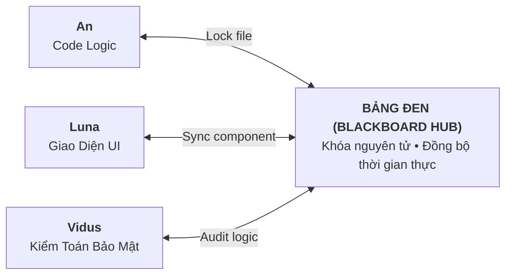

# Bảng đen Cộng tác Đa Agent (Blackboard Hub)

Khi bạn làm việc với nhiều AI Agent cùng lúc, rủi ro lớn nhất là: **Agent này sửa file và vô tình ghi đè lên phần việc của Agent khác**, dẫn đến xung đột code (Merge Conflicts) và mất mát dữ liệu.

**Blackboard Hub** đóng vai trò như một **"Chiếc Bảng Đen Phòng Họp"** dùng chung: nơi các AI trong Biệt đội cùng nhìn vào một nguồn sự thật, trao đổi giải pháp và phối hợp nhịp nhàng mà không bao giờ giẫm chân lên nhau.

---

## 1. Cách Blackboard Hub Hoạt Động

1. **Khóa Phiên Bản An Toàn (Optimistic Version Lock)**: Trước khi sửa một tệp code nhạy cảm, Agent thông báo dự định lên Bảng Đen. Nếu có Agent khác đang thao tác trên cùng tệp, hệ thống tự động ngăn chặn việc ghi đè mù quáng.
2. **Kênh Thảo Luận Nội Bộ**: Các Agent có thể gửi tin nhắn trao đổi kỹ thuật cho nhau trực tiếp trên Bảng Đen để thống nhất giao diện API trước khi viết code.

---

## 2. Quy Trình Phản Biện Chéo (Peer Review Giữa Các Agent)

Điểm độc đáo của Aevum OS là các AI có thể tự phản biện và chấm điểm chéo cho nhau để nâng cao chất lượng mã nguồn:

* **Mở Phiên Review**: Khi An lập xong một kế hoạch kỹ thuật, An có thể gửi lời mời Vidus và Hawl vào phản biện.
* **Đề Xuất Bản Vá (Proposal)**: **Hawl** (Chuyên gia Bảo mật) có thể gửi nhận xét: *"Đoạn code này chưa kiểm tra thời hạn token, đề xuất bổ sung kiểm tra Redis TTL"*.
* **Bạn Luôn Là Người Nắm Quyền Quyết Định**: Toàn bộ quá trình thảo luận và các đề xuất đều hiển thị minh bạch để bạn xem xét và phê duyệt trước khi áp dụng vào code thực tế.

---

## 3. Lợi Ích Thực Tế Cho Lập Trình Viên

* **Không Lo Xung Đột Code**: Bạn có thể thoải mái giao việc cho 3-4 Agent chạy song song mà không sợ hỏng project.
* **Chất Lượng Code Cao Hơn**: Code vừa được viết ra đã có sẵn chuyên gia bảo mật và kiến trúc sư AI phản biện tự động.
* **Theo Dõi Tiến Độ Tập Trung**: Mọi hoạt động của Biệt đội đều được hiển thị trực quan trên ứng dụng **Desktop Control Center**.
