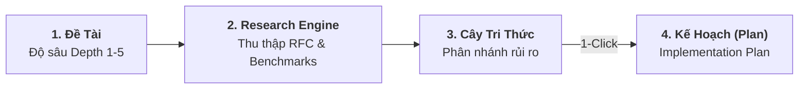

# Không gian Nghiên cứu Tự trị (Deep Research Engine)

Khi bắt đầu một bài toán công nghệ mới (ví dụ: *Nên chọn giải pháp xác thực nào cho Microservices? Cách thiết lập Distributed Cache chịu tải 100k CCU?*), lập trình viên thường mất hàng giờ đọc tài liệu và so sánh các bài viết trên mạng.

**Deep Research Engine** trong Aevum OS là trợ lý nghiên cứu tự trị: cho phép AI tự động thu thập tài liệu, phân tích ưu nhược điểm đa chiều và biến kết quả nghiên cứu thành **Kế hoạch Kỹ thuật thực thi chỉ với 1 thao tác**.

---

## 1. Khởi Chạy Nhiệm Vụ Nghiên Cứu Bằng Chat Tự Nhiên

Bạn chỉ cần giao đề tài cho AI kèm độ sâu nghiên cứu mong muốn (từ mức 1: tóm tắt nhanh đến mức 5: phân tích kiến trúc chuyên sâu):

> *"An ơi, hãy nghiên cứu chuyên sâu về các phương án chống tấn công Replay Attack cho JWT với độ sâu mức 3 nhé."*

AI sẽ tự động:
1. Đọc tài liệu đặc tả kỹ thuật chính thức (RFC specs, OWASP benchmarks).
2. Phân tầng nguồn tin cậy (nguồn chuẩn quốc tế vs bài blog tham khảo).
3. Đúc kết các ưu điểm, nhược điểm và rủi ro tiềm ẩn thành một bản báo cáo kỹ thuật rõ ràng.

---

## 2. Trực Quan Hóa Chòm Sao Cây Kỹ Năng (Skill Tree Canvas)

Trên ứng dụng **Desktop Control Center**:
* Toàn bộ tiến trình nghiên cứu được hiển thị thành một **Chòm sao Kỹ năng tương tác**.
* Các chủ đề nhánh (Sub-topics) tự động rẽ nhánh đệ quy như một sơ đồ tư duy (Mindmap).
* Nút nào đang nghiên cứu sẽ phát sáng, nút nào đã làm chủ sẽ chuyển sang trạng thái tinh thông (*Mastered*).

---

## 3. Tính Năng Đột Phá: Thăng Cấp Thành Kế Hoạch (1-Click Promote to Plan)

Điểm khác biệt lớn nhất giữa Aevum OS và việc tra cứu thông thường: **Tri thức nghiên cứu kết nối trực tiếp với luồng viết code**.

Sau khi bản báo cáo nghiên cứu hoàn tất, bạn chỉ cần nhắn:

> *"Báo cáo rất chi tiết! Hãy biến đề xuất này thành Kế hoạch thực thi trong dự án nhé."*

Hệ thống sẽ tự động kích hoạt tính năng **Promote to Plan**:
* Chuyển hóa toàn bộ khuyến nghị kiến trúc thành danh sách đầu việc cụ thể trong file `implementation_plan.md`.
* Gán kế hoạch cho Persona phù hợp trong Biệt đội để bắt tay vào viết code và test ngay lập tức!
